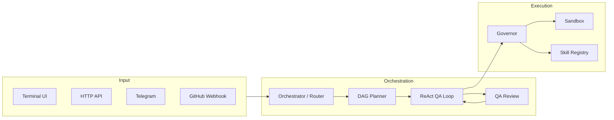

# IronClad

**Secure-by-Design Autonomous AI Agent — Built in Rust**

[](LICENSE)
[](https://www.rust-lang.org/)
[]()

<p align="center">
  
</p>

IronClad is a fully autonomous AI agent that treats the LLM as an **untrusted component**. Every action passes through a policy engine (The Governor) before reaching the system, giving you autonomous capability without sacrificing security.

---

## Table of Contents

- [What is IronClad?](#what-is-ironclad)
- [Quick Start](#quick-start)
- [Use Cases](#use-cases)
- [Features](#features)
- [Architecture](#architecture)
- [Installation](#installation)
- [Configuration](#configuration)
- [Documentation](#documentation)
- [Development](#development)
- [License](#license)

---

## What is IronClad?

IronClad is a Rust-based AI agent that can autonomously:
- **Read and write files**, run shell commands, execute git operations
- **Browse the web**, scrape pages, search GitHub and academic papers
- **Plan and execute** multi-step tasks using a DAG-based task planner
- **Schedule background jobs**, monitor health, and react to GitHub webhooks
- **Delegate sub-tasks** to specialized inline sub-agents

The key difference from other agents: IronClad classifies every action (Green / Yellow / Red / Blocked) and requires explicit approval for dangerous operations — even in autonomous mode.

**Supported LLM providers:** Ollama (local, default) · OpenAI · Anthropic · Google Gemini · NVIDIA NIM · **Any OpenAI-compatible API** (LM Studio, Text Generation Web UI, llama.cpp server, etc.)

---

## Quick Start

**The easiest way to get started is by downloading the latest release for your platform.**

1.  **Download**: Get the [latest release](https://github.com/overcrash66/IronClad/releases) for your OS (Windows, Linux, or macOS).
2.  **Extract**: Unzip or untar the archive to a folder of your choice.
3.  **Run**:
    - **Windows**: Double-click `ironclad-ai-agent.exe` or run `.\ironclad-ai-agent.exe` in PowerShell.
    - **Linux / macOS**: Run `./ironclad-ai-agent` in your terminal.
4.  **Prerequisites**: [Ollama](https://ollama.com/) installed and a model pulled (e.g. `ollama pull llama3`).

**Web Dashboard (Recommended Setup):**
Once running, open `http://127.0.0.1:8080` in your browser. The Web Dashboard's **⚙ Settings** and **📖 Guides** tabs provide the easiest way to configure IronClad entirely visually!

---

## Use Cases

### Software Development

```
> Refactor the authentication module to use JWT tokens
> Review src/api/routes.rs for security vulnerabilities
> Write unit tests for the DAG planner and verify they pass
> Find all TODO comments in the codebase and create a task list
```

### Research & Analysis

```
> Research the latest transformer attention mechanisms across GitHub and arXiv
> Search Semantic Scholar for papers on retrieval-augmented generation with 1000+ citations
> Summarize the top 5 Rust async runtime projects and compare their architectures
```

### DevOps & CI

```bash
# Trigger via HTTP API
curl -X POST http://localhost:3000/api/v1/tasks \
  -H "Content-Type: application/json" \
  -d '{"task": "Check the last 10 git commits and write a release summary", "persona": "coder"}'

# Or via GitHub Actions (see workspace/templates/ironclad-ai-agent.yml)
gh workflow run ironclad-ai-agent.yml --field task="Review the PR diff and suggest improvements"
```

### Automated Monitoring

```toml
# In settings.toml — schedule a nightly health check
[pulse]
enabled = true
```

```
> Schedule a job every day at 9am to check disk usage and alert if above 80%
> Set up a weekly job to scan open GitHub issues and draft a triage summary
```

### Long-Running Autonomous Tasks (Experiment Loop)

```
> Use experiment_loop to optimize the response latency of the API with at most 10 iterations
```

The `experiment_loop` skill proposes code changes, runs a metric command, and uses git stash to revert failed attempts — fully automated.

### Content Automation

```
> Schedule the faceless YouTube pipeline to run every day at 3 AM for the tech niche
```

The `faceless_yt_pipeline` skill acts as an autonomous media company, generating scripts, TTS, compiling clips, and exporting a ready-to-upload MP4.

### Telegram Remote Control

```
# Send from Telegram (after configuring the bot)
/ask Summarize my unread GitHub notifications
/ask Run cargo test and tell me what failed
```

---

## Features

### Core Agent

| Feature | Description |
|---------|-------------|
| **ReAct Loop** | Think → Act → Observe cycles with multi-tool dispatch per turn |
| **Native Tool Calling** | OpenAI and Anthropic use structured APIs; others fall back to XML parsing |
| **Self-Reflection** | After completing a task, the agent critiques its own output and loops back to fix issues |
| **DAG Planner** | Decomposes complex tasks into a parallel directed acyclic graph |
| **DAG Re-planning** | When a node fails, the planner LLM generates a revised sub-DAG (max 2 attempts) |
| **Sub-Agent Delegation** | `delegate_task` spawns an isolated sub-agent for a focused sub-task |
| **Context Compression** | Optionally summarizes dropped messages before applying the sliding window |
| **Session Budget** | Wall-clock time limit that gracefully stops a runaway session |

### Skills (Built-in Tools)

| Category | Skills |
|----------|--------|
| **Files** | `read_file`, `write_file`, `list_directory`, `replace_in_file`, `grep_search` |
| **Shell** | `shell_execute`, `run_tests`, `system_info` |
| **Git** | `git_ops` (status, diff, log, branch, stash — writes are Traffic Light gated) |
| **Web** | `search_web`, `browser_scrape`, `browser_visit` |
| **Research** | `deep_research` (GitHub + arXiv + Semantic Scholar) |
| **GitHub** | `github_list_issues`, `github_list_prs` |
| **Memory** | `remember`, `search_history`, `query_history`, `query_logs` |
| **Planning** | `delegate_task`, `list_tools`, `ask_user`, `write_todos` |
| **Scheduling** | `schedule_job` |
| **Workspace** | `list_workspaces`, `browse_workspace`, `create_tool` |
| **RAG** | `query_knowledge_base` |
| **Media** | `speak` (TTS), `transcribe` (STT), `translate`, `faceless_yt_pipeline` |
| **Security** | `bug_bounty_scan` |
| **Remote** | `remote_agent` (delegates to external HTTP endpoint) |

### Security

| Feature | Description |
|---------|-------------|
| **Three-Ring Architecture** | LLM → Governor → Executor — the LLM never touches the system directly |
| **Traffic Light Policy** | Every action classified: Green (auto), Yellow (notify), Red (confirm), Blocked |
| **Python Isolation** | **(New)** Mandatory venv enforcement to prevent system dependency corruption |
| **System Command Control** | **(New)** Global toggle to block dangerous commands (apt, sudo) even for trusted tools |
| **Secret Scrubbing** | API keys are redacted from all LLM context |
| **Workspace Boundary** | File and shell skills cannot escape the configured workspace |
| **Audit Log** | Every prompt, response, and command recorded in `ironclad_audit.db` (SQLite) |

### Integrations

| Integration | Details |
|-------------|---------|
| **HTTP API** | Axum-based REST API (`POST /api/v1/tasks`, `GET /api/v1/sessions/:id/status`) |
| **GitHub Webhooks** | `POST /api/v1/webhooks/github` — receive push/issue events, spawn agent task |
| **GitHub Actions** | Ready-made workflow template in `workspace/templates/ironclad-ai-agent.yml` |
| **Telegram** | Long-polling bot; `allowed_chat_ids` and `trusted_chat_ids` for access control |
| **MCP** | Model Context Protocol server support for additional tools |
| **LangGraph** | Export / import session state as LangGraph-compatible checkpoints |
| **Remote Agents** | HTTP bridge to any OpenAI-compatible or LangGraph endpoint |
| **RAG** | Local vector database (Ollama / OpenAI / NVIDIA embeddings) |

### Execution Backends

| Backend | Speed | Isolation | Best For |
|---------|-------|-----------|----------|
| `local` | ⚡ Fastest | None | Development, trusted environments |
| `wsl` | Fast | WSL boundary | Windows daily use (default) |
| `docker` | Moderate | Full container | Production, multi-tenant |

---

## Architecture

IronClad uses a **Three-Ring Security Model**:

```
  ┌──────────────────────────────────────────────────┐
  │  Ring 1 — The Dreamer (LLM)                      │
  │  Generates intentions, has NO direct system access│
  └────────────────────┬─────────────────────────────┘
                       │  intents
  ┌────────────────────▼─────────────────────────────┐
  │  Ring 2 — The Governor (Policy Engine)            │
  │  Traffic Light: Green / Yellow / Red / Blocked    │
  └────────────────────┬─────────────────────────────┘
                       │  approved actions
  ┌────────────────────▼─────────────────────────────┐
  │  Ring 3 — The Executor (Sandbox)                  │
  │  WSL · Docker · Local — isolated execution        │
  └──────────────────────────────────────────────────┘
```

**Request flow:**



---

## Installation

### Prerequisites

#### Rust (required for `cargo install` or building from source)

Install Rust from [rustup.rs](https://rustup.rs/):

**Linux/macOS:**
```bash
curl --proto '=https' --tlsv1.2 -sSf https://sh.rustup.rs | sh
```

**Windows:**
Download and run `rustup-init.exe` from [rustup.rs](https://rustup.rs/).

**Platform-Specific Build Requirements:**

| Platform | Requirements |
|----------|-------------|
| **Linux** | Requires a C compiler and development libraries:<br>`sudo apt-get update && sudo apt-get install build-essential pkg-config libssl-dev` (Ubuntu/Debian)<br>`sudo dnf install gcc openssl-devel` (Fedora/RHEL) |
| **macOS** | Requires Xcode Command Line Tools:<br>`xcode-select --install` |
| **Windows** | Requires Visual Studio Build Tools with "Desktop development with C++" workload ([download](https://visualstudio.microsoft.com/downloads/)) |

#### LLM Provider (choose one)

IronClad works with a wide range of LLM providers. Pick whichever fits your setup:

| Provider | Type | Setup |
|----------|------|-------|
| **Ollama** (default) | Local | Install from [ollama.com](https://ollama.com/), then pull a model: `ollama pull llama3` |
| **LM Studio** | Local | Download from [lmstudio.ai](https://lmstudio.ai/), start the local server (default: `http://127.0.0.1:1234/v1`), configure as `openai` provider |
| **OpenAI** | Cloud | Set `default_provider = "openai"` and export `IRONCLAD_OPENAI_KEY="sk-..."` |
| **Anthropic** | Cloud | Set `default_provider = "anthropic"` and export `IRONCLAD_ANTHROPIC_KEY="sk-ant-..."` |
| **Google Gemini** | Cloud | Set `default_provider = "gemini"` and configure your API key |
| **NVIDIA NIM** | Cloud | Set `default_provider = "nvidia"` and export your API key |
| **Any OpenAI-compatible API** | Local/Cloud | Works with Text Generation Web UI, llama.cpp server, vLLM, etc. — configure as `openai` provider with a custom `base_url` |

> **Tip:** For local models, Ollama is the easiest to get started with. LM Studio is great if you prefer a GUI for downloading and managing models. Any OpenAI-compatible server just needs its `base_url` pointed at the right endpoint.

#### Other Requirements

| Requirement | Notes |
|-------------|-------|
| **WSL2** or **Docker** | Optional — only needed for `wsl` / `docker` backends |

### Install via crates.io

If you have Rust installed, you can install IronClad directly from crates.io:

```bash
cargo install ironclad-ai-agent
```

Verify the installation:

```bash
ironclad-ai-agent --version
```

---

## Configuration

All options live in `settings.toml`. The most important ones:

```toml
[sandbox]
backend = "wsl"          # "wsl" | "docker" | "local"

[llm]
default_provider = "ollama"   # "ollama" | "openai" | "anthropic" | "gemini" | "nvidia"
# Use "openai" with any OpenAI-compatible server (LM Studio, Text Generation Web UI, etc.)
turbo_mode = false            # true = skip orchestrator + QA (fastest)
agentic_mode = true           # ReAct loop (recommended)
max_tool_calls = 30           # tool budget per task
max_parallel_tools = 4        # concurrent tool calls per turn
context_compression = false   # summarize dropped messages
# session_budget_secs = 600   # optional time cap

[llm.ollama]
base_url = "http://127.0.0.1:11434"
model = "llama3"
keep_alive = "10m"

# LM Studio or any OpenAI-compatible API (e.g., Text Generation Web UI, llama.cpp server)
[llm.openai]
base_url = "http://127.0.0.1:1234/v1"  # LM Studio default port
model = "llama-3.1-8b-instruct"
```

**API keys** are read from environment variables (never put them in `settings.toml`):

```bash
export IRONCLAD_OPENAI_KEY="sk-..."
export IRONCLAD_ANTHROPIC_KEY="sk-ant-..."
export IRONCLAD_GITHUB_KEY="ghp_..."
export IRONCLAD_TELEGRAM_KEY="123456:ABC-..."
```

See [docs/configuration.md](docs/configuration.md) for the full reference.

---

## Documentation

> **Full documentation hub:** [docs/index.md](docs/index.md)

### Getting Started

| Document | Description |
|----------|-------------|
| [Quick Start Guide](docs/quickstart.md) | Install, configure, and run your first task in 5 minutes |
| [User Guide](user_guide_info.md) | Comprehensive user guide covering features, security, integrations, and more |
| [Configuration Reference](docs/configuration.md) | Every `settings.toml` option explained |
| [TUI Guide](docs/tui.md) | Terminal UI layout, slash commands, keyboard shortcuts |
| [Architecture Overview](docs/architecture.md) | Three-Ring model, data flow, component map |

### Skills & Features

| Document | Description |
|----------|-------------|
| [Deep Research](docs/deep_research.md) | GitHub · arXiv · Semantic Scholar multi-source research |
| [Experiment Loop](docs/experiment_loop.md) | Autonomous iterative improvement with metric tracking |
| [Concurrent Tool Dispatch](docs/concurrent-tools.md) | Parallel tool execution, `max_parallel_tools` config |
| [Session Budget](docs/session-budget.md) | Wall-clock time limits for tasks |
| [RAG Knowledge Base](docs/rag.md) | Codebase indexing and similarity search |
| [Write Todos](docs/write-todos.md) | Persistent task lists across agent turns |
| [program.md](docs/program-md.md) | Per-workspace instructions injected into every task |
| [Autonomy](docs/autonomy.md) | Autonomous mode and Yellow/Red approval behaviour |
| [Benchmark Suite](docs/benchmarks.md) | Deterministic offline tests and `bench_results.json` |
| [System Prompts](docs/prompts.md) | Prompt templates, personas, customisation |

### Integrations & Deployment

| Document | Description |
|----------|-------------|
| [HTTP API Setup](docs/api_setup.md) | REST API endpoints, authentication, webhook ingestion |
| [GitHub Action](docs/github-action.md) | CI/CD workflow template and usage examples |
| [Integrations](docs/integrations.md) | LangGraph checkpoints, Remote Agents, Telegram, GitHub |
| [Remote Agent Bridge](docs/remote-agent.md) | Delegate tasks to external agent endpoints |
| [Telegram Setup](docs/configuration.md#integrationstelegram) | Bot configuration and access control |
| [Web Dashboard](docs/dashboard.md) | Real-time observability UI, visual Settings management, and Interactive Guides |
| [Pulse Scheduler](docs/pulse_scheduler.md) | Cron background jobs |
| [MCP Setup](docs/mcp_setup.md) | Model Context Protocol server integration |
| [Browser Automation](docs/browser_automation.md) | Playwright web scraping and visual browsing |

### Execution Backends

| Document | Description |
|----------|-------------|
| [Local Backend](docs/local_backend.md) | Host execution without sandbox isolation |
| [Multimodal Setup](docs/multimodal_setup.md) | TTS / STT / image input configuration |
| [Local STT Setup](docs/local_stt_setup.md) | Speech-to-text with local models |

---

## WSL2 Tips

For best performance on Windows with Ollama running under WSL2:

```ini
# %USERPROFILE%\.wslconfig
[wsl2]
networkingMode=mirrored
dnsTunneling=true
autoMemoryReclaim=gradual
```

Use `127.0.0.1` instead of `localhost` in `settings.toml` to avoid ~300ms DNS delays:

```toml
[llm.ollama]
base_url = "http://127.0.0.1:11434"
```

---

## Development

```bash
cargo check          # fast type-check
cargo test           # run all tests
cargo test --test benchmarks   # offline benchmark suite
cargo clippy         # lint
```

Tests write `bench_results.json` to the project root (gitignored).

---

## License

[GNU General Public License v3.0](LICENSE)
