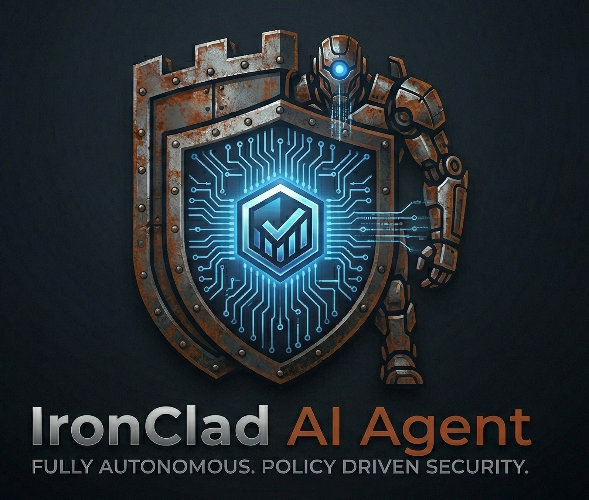

# 🛡️ IronClad AI Agent

**The Secure-by-Design, Local-First Autonomous AI Agent Runtime & Multi-Agent Orchestration Harness — Built in Rust.**

[](https://crates.io/crates/ironclad-ai-agent)
[](https://github.com/overcrash66/IronClad-AI-Agent)
[](https://github.com/overcrash66/IronClad-AI-Agent/issues)
[](https://zenodo.org/records/22069766)
[](docs/index.md)
[](LICENSE)
[](https://www.rust-lang.org/)
[]()
[]()
[]()

<p align="center">
  
</p>

---

## 🌟 What is IronClad?

IronClad is an **armored, local-first autonomous AI agent runtime**. 

Traditional AI coding assistants give large language models unchecked access to your shell and filesystem, creating risks of data loss, prompt injection vulnerabilities, and expensive API bills. 

**IronClad solves this with three foundational principles:**

1. 🔒 **100% Private & Local-First**: Run entirely on your local machine using **LM Studio** or **Ollama** with zero token costs and zero telemetry leaving your device. *(Cloud models like Claude, OpenAI, Gemini, and NVIDIA NIM are also fully supported).*
2. 🛡️ **Zero-Trust Security Governor (Three-Ring Model)**: The LLM is treated as an *untrusted component*. Every shell command, file write, and git action is inspected and gated by the **Governor** using a strict Traffic Light policy before running in sandboxes (Docker, WSL2, or Local host).
3. ⚡ **Autonomous Multi-Agent Orchestrator**: Automates complex workflows — background cron jobs (*Pulse*), Karpathy-style autonomous optimization loops (*Experiment Loop*), AST codebase search (*Tree-sitter RAG*), and automated delegation to external CLI agents (*Pi Agent, Claude Code, Aider, OpenCode, Gemini CLI*).

---

## 💡 Recommended Local Setup: LM Studio (v0.6.7 & Future Releases)

> **For the best local AI experience in IronClad version 0.6.7 and future releases, we recommend using [LM Studio](https://lmstudio.ai/)** (or [Ollama](https://ollama.com/)).

### Why LM Studio?
- ⚡ **High Performance & GPU Acceleration**: Fast local inference using Metal (macOS), CUDA (NVIDIA), and ROCm/Vulkan (AMD/Intel).
- 📦 **1-Click Model Downloads**: Easily search, download, and switch between top coding models (e.g. `Qwen 2.5 Coder 32B`, `Qwen 3.8`, `DeepSeek-R1`, `Llama 3.3`).
- 🔌 **Standard OpenAI-Compatible API**: Serves a local API endpoint on `http://127.0.0.1:1234/v1`.
- 🧠 **Dynamic Benchmark Scoring**: Fully integrated with IronClad's 8-pillar benchmark scoring and automated model lifecycle management.

### Quick 3-Step LM Studio Setup:
1. Download and install **[LM Studio](https://lmstudio.ai/)**.
2. Search and download a model (recommended: **`qwen2.5-coder-32b-instruct`** or **`deepseek-r1-distill-qwen-32b`**).
3. Go to the **Developer / Local Server tab** (`<->`), select your model, and click **Start Server** on port `1234`.

---

## ⚡ Quick Start (Up & Running in 3 Steps)

### 1. Install IronClad

Install the released binary directly via Cargo:

```bash
cargo install ironclad-ai-agent
```

*(Packages, releases, and crate documentation are available on [crates.io/crates/ironclad-ai-agent](https://crates.io/crates/ironclad-ai-agent)).*

### 2. Configure `settings.toml`

Create or edit `settings.toml` in your working directory:

```toml
[sandbox]
backend = "local"           # Options: "local", "wsl", "docker"

[llm]
default_provider = "openai" # "openai" for LM Studio, "ollama" for Ollama
agentic_mode = true

# LM Studio (Recommended for v0.6.7+)
[llm.openai]
base_url = "http://127.0.0.1:1234/v1"
model = "qwen2.5-coder-32b-instruct"

# Or Ollama (Local alternative)
[llm.ollama]
base_url = "http://127.0.0.1:11434"
model = "llama3"
```

### 3. Launch IronClad

```bash
# Launch interactive Terminal UI (TUI)
ironclad

# Run a single autonomous task from CLI
ironclad orchestrate --task "Analyze src/ and list all public structs"

# List past sessions
ironclad sessions

# Run an autonomous maintenance pulse job
ironclad pulse --mode full

# Launch headless REST API server
ironclad serve --port 3000

# Run 8-pillar benchmark evaluation
ironclad benchmark --mode comparative

# Or open the Web Dashboard in your browser (Recommended)
# Navigate to: http://127.0.0.1:8080
```

---

## 🖥️ Choose Your Interface

```
┌────────────────────────────────────────────────────────────────────────┐
│                      5 Ways to Experience IronClad                     │
├────────────────────┬────────────────────┬──────────────────────────────┤
│ 🌐 Web Dashboard   │ 💻 Terminal TUI    │ ⚡ CLI One-Shot Orchestrator  │
│ Visual control at  │ Interactive text   │ Single command execution:    │
│ 127.0.0.1:8080     │ UI with live token │ `ironclad orchestrate        │
│ with live guides.  │ streaming & stats. │   --task "..."`              │
├────────────────────┴────────────────────┴──────────────────────────────┤
│ 🔗 Headless REST API & Webhooks         │ 📱 Telegram Remote Bot       │
│ Axum API (`POST /api/v1/tasks`) and     │ Control your agent & receive │
│ GitHub Webhook event ingestion.         │ voice/text alerts anywhere.  │
└─────────────────────────────────────────┴──────────────────────────────┘
```

---

## 🤖 Supported LLM Providers

| Provider | Type | Recommended Models | Endpoint / Setup |
|---|---|---|---|
| **LM Studio** *(Recommended)* | Local | `qwen2.5-coder:32b`, `deepseek-r1:32b`, `llama3.3:70b` | `default_provider = "openai"`, `base_url = "http://127.0.0.1:1234/v1"` |
| **Ollama** | Local | `llama3`, `qwen2.5-coder:32b`, `deepseek-r1` | `default_provider = "ollama"`, `base_url = "http://127.0.0.1:11434"` |
| **Anthropic Claude** | Cloud | `claude-3-5-sonnet-20240620`, `claude-3-5-haiku` | `export ANTHROPIC_API_KEY="sk-ant-..."` |
| **OpenAI** | Cloud | `gpt-4o`, `gpt-4o-mini`, `o1`, `o3-mini` | `export OPENAI_API_KEY="sk-..."` |
| **Google Gemini** | Cloud | `gemini-1.5-pro`, `gemini-2.0-flash` | `export GEMINI_API_KEY="AIzaSy..."` |
| **NVIDIA NIM** | Cloud | `meta/llama-3.3-70b-instruct`, `deepseek-r1` | `export NVIDIA_API_KEY="nvapi-..."` |

---

## 🧰 Built-in Skills (Tools Matrix)

| Category | Available Skills |
|---|---|
| 📁 **File System** | `read_file`, `write_file`, `list_directory`, `replace_in_file`, `grep_search` |
| 💻 **Shell & Sandbox** | `shell_execute`, `run_tests`, `system_info`, `reviewer`, `post_mortem` |
| 🌿 **Git Ops** | `git_ops` (status, diff, log, branch, stash — write actions Traffic Light gated) |
| 🌐 **Web & Browsing** | `search_web`, `browser_scrape`, `browser_visit` (Playwright-powered) |
| 🔬 **Deep Research** | `deep_research` (Multi-source search across GitHub, arXiv, and Semantic Scholar) |
| 🐙 **GitHub Integration** | `github_list_issues`, `github_list_prs` |
| 🧠 **Memory & Persistence** | `remember`, `search_history`, `query_history`, `query_logs`, `core_memory_*` |
| 👥 **Multi-Agent Hub** | `delegate_task`, `delegate_to_cli_agent`, `subprocess_manager`, `agent_coordination` |
| 🧭 **Planning & Reasoning** | `list_tools`, `ask_user`, `write_todos`, `think`, `reflection`, `research_plan` |
| 📚 **AST Codebase RAG** | `query_knowledge_base` (Tree-sitter AST indexed vector search) |
| ⏰ **Scheduler** | `schedule_job` (Pulse cron engine with natural language parsing) |
| 🎬 **Autonomous Pipelines**| `experiment_loop`, `bug_bounty_scan_py`, `faceless_yt_pipeline` |
| 🗣️ **Voice & Media** | `speak` (TTS), `transcribe` (Whisper STT), `translate` |
| 🔌 **External Tool Protocol** | Model Context Protocol (**MCP**) server auto-discovery |

---

## 📖 Documentation Hub

Explore the complete documentation in the [`docs/`](docs/index.md) directory:

### 🚀 Getting Started & Interfaces
- 📘 **[Quick Start Guide](docs/quickstart.md)** — Get up and running in under 5 minutes.
- 🌐 **[Web Dashboard Guide](docs/dashboard.md)** — Observability control center, settings editor, and interactive tutorials.
- ⚙️ **[Configuration Reference](docs/configuration.md)** — Comprehensive guide to every `settings.toml` option and environment variable.
- 💻 **[Terminal UI (TUI) Guide](docs/tui.md)** — Keyboard shortcuts, slash commands, image attachments, and user dialogs.
- ⚡ **[Local Execution Backend](docs/local_backend.md)** — High-speed host execution without container overhead.

### 🏛️ Architecture & Security
- 🛡️ **[Architecture Overview](docs/architecture.md)** — Three-Ring zero-trust security model, DAG planner, and data flow.
- 🚦 **[Autonomy & Traffic Light Policy](docs/autonomy.md)** — Green / Yellow / Red / Blocked intent classification.
- ⏱️ **[Session Budget](docs/session-budget.md)** — Wall-clock runtime limits for runaway sessions.
- ⚡ **[Concurrent Tool Dispatch](docs/concurrent-tools.md)** — Parallel tool execution and file-backed outputs.
- 📝 **[System Prompts](docs/prompts.md)** — Prompt assembly, personas, and execution protocols.
- 📋 **[program.md Workspace Behaviour](docs/program-md.md)** — Per-workspace persistent instructions injected into prompts.
- 📐 **[Architecture Decision Records (ADRs)](docs/adr/)** — Engineering design decisions (ADR 001 to ADR 006).

### 🤖 Autonomous Skills & Pipelines
- 🔬 **[Experiment Loop](docs/experiment_loop.md)** — Autonomous Karpathy-style code optimization with git rollbacks.
- 📚 **[RAG Knowledge Base](docs/rag.md)** — Tree-sitter AST parsing and semantic vector retrieval for codebases.
- ⏰ **[Pulse Scheduler](docs/pulse_scheduler.md)** — Natural language cron scheduling and autonomous background workers.
- 🔍 **[Deep Research](docs/deep_research.md)** — Autonomous multi-source research across GitHub, arXiv, and Semantic Scholar.
- 🛡️ **[Bug Bounty Scanner](docs/bug_bounty.md)** — Blue team host OS security hardening, open-source repository SAST auditing, and ethical reconnaissance.
- 🎬 **[Faceless YouTube Pipeline](docs/faceless_youtube.md)** — Autonomous video production from trend scraping to MP4 export.
- 📝 **[Write Todos](docs/write-todos.md)** — Persistent structured task tracking across agent turns.
- 🧠 **[Memory & Session Persistence](docs/memory_management.md)** — SQLite history, context compression, and semantic memory search.
- 🛠️ **[Custom Tools & Auto-Discovery](docs/custom_tools.md)** — Write custom Python, Bash, or PowerShell tools with hot-reloading.

### 🔌 Integrations & Deployments
- 🔗 **[Integrations Overview](docs/integrations.md)** — LangGraph checkpoints, external CLI agents, and background subprocesses.
- 🤖 **[External CLI Agents Hub](docs/integrations.md#external-cli-agents-hub-delegate_to_cli_agent)** — Auto-detect and drive Pi Agent, Claude Code, Aider, OpenCode, and Gemini CLI.
- 🚀 **[Pi Agent Setup Guide](docs/guides/pi-agent-setup.md)** — Setting up Pi coding agent for autonomous task escalation.
- 🔌 **[Model Context Protocol (MCP)](docs/mcp_setup.md)** — Connect external MCP servers for extended capabilities.
- 🌐 **[HTTP API & Webhooks](docs/api_setup.md)** — REST endpoints for submitting tasks and ingesting GitHub webhooks.
- 🐙 **[GitHub Actions Workflow](docs/github-action.md)** — CI/CD automation template for running IronClad in CI.
- 📱 **[Telegram Bot Integration](docs/telegram_setup.md)** — Remote control, voice message transcription, and status alerts.
- 🎭 **[Browser Automation](docs/browser_automation.md)** — Playwright web scraping and visual browser visiting.
- 🖼️ **[Multimodal Setup](docs/multimodal_setup.md)** — Vision model configuration and image analysis.
- 🎙️ **[Local STT Setup](docs/local_stt_setup.md)** — Local speech-to-text with Whisper or OpenAI-compatible endpoints.
- 📊 **[Benchmark & Evaluation Suite](docs/benchmarks.md)** — Deterministic offline benchmarks and multi-model matrix evaluation.
- 🧪 **[Master Test Plan & Verification Guide](docs/master_test_plan.md)** — 7-pillar master test plan for swarms, webhooks, MCP, external agents, and cluster federation.

---

## 📄 Research Publications

Read the research publications detailing IronClad's architecture, security proofs, context engineering, and empirical evaluations:

### 1. 📑 System Architecture & Security Foundations
- **Title**: **[IronClad AI Agent: A Secure-by-Design, Rust-Native Autonomous AI Agent Orchestration Framework for Consumer Hardware](https://zenodo.org/records/22069766)**
- **Author**: **Wael SAHLI**
- **DOI**: [`10.5281/zenodo.22069766`](https://doi.org/10.5281/zenodo.22069766) · **PDF**: [Download via Zenodo](https://zenodo.org/records/22069766/files/ironclad_white_paper.pdf)
- **Key Findings**: Zero-Trust Three-Ring security model, Tokio DAG task planning within 16 GB VRAM budgets, 90.0% AgentBench OS/DB success rate, and 100% Promptfoo red-team defense pass rate.

### 2. 🧠 Context Engineering & Multi-Tier Memory Subsystems
- **Title**: **[Context Engineering and Multi-Tiered Memory Architectures for Local Large Language Model Agents: Mitigating Token Bloat, Context Degradation, and Trivial Task Overthinking](docs/white_paper_context_memory.md)**
- **Author**: **Wael SAHLI**
- **Key Findings**: Four-Tier Memory Architecture (Working, Core, Episodic, Semantic AST RAG), Input Intent Fast-Bypass (cutting trivial query latency by 91.2% and saving 98.3% tokens on greetings/acknowledgments), file-backed tool output offloading (>8,000 chars), and recursive summarization for multi-turn local LLM stability.

---

## 🛠️ Development & Testing

```bash
# Type check the codebase
cargo check

# Run all unit and integration tests
cargo test

# Run deterministic offline benchmarks
cargo test --test benchmarks

# Lint with Clippy
cargo clippy
```

---

## 💬 Community, Issues & Feedback

We welcome feedback, bug reports, and community feature requests!
- 🐛 **Report Issues & Bugs**: [https://github.com/overcrash66/IronClad-AI-Agent/issues](https://github.com/overcrash66/IronClad-AI-Agent/issues)
- 💡 **Feature Requests & Ideas**: Open an issue on our [Issue Tracker](https://github.com/overcrash66/IronClad-AI-Agent/issues)
- 🐙 **Public GitHub Repository**: [https://github.com/overcrash66/IronClad-AI-Agent](https://github.com/overcrash66/IronClad-AI-Agent)

---

## 📦 Package & Distribution

- **Crates.io Package**: [https://crates.io/crates/ironclad-ai-agent](https://crates.io/crates/ironclad-ai-agent)

---

## 👤 Author & Maintainer

- **Author**: **Wael SAHLI** ([@overcrash66](https://github.com/overcrash66))

---

## 📄 License

IronClad is open-source software licensed under the **[GNU General Public License v3.0](LICENSE)**.
